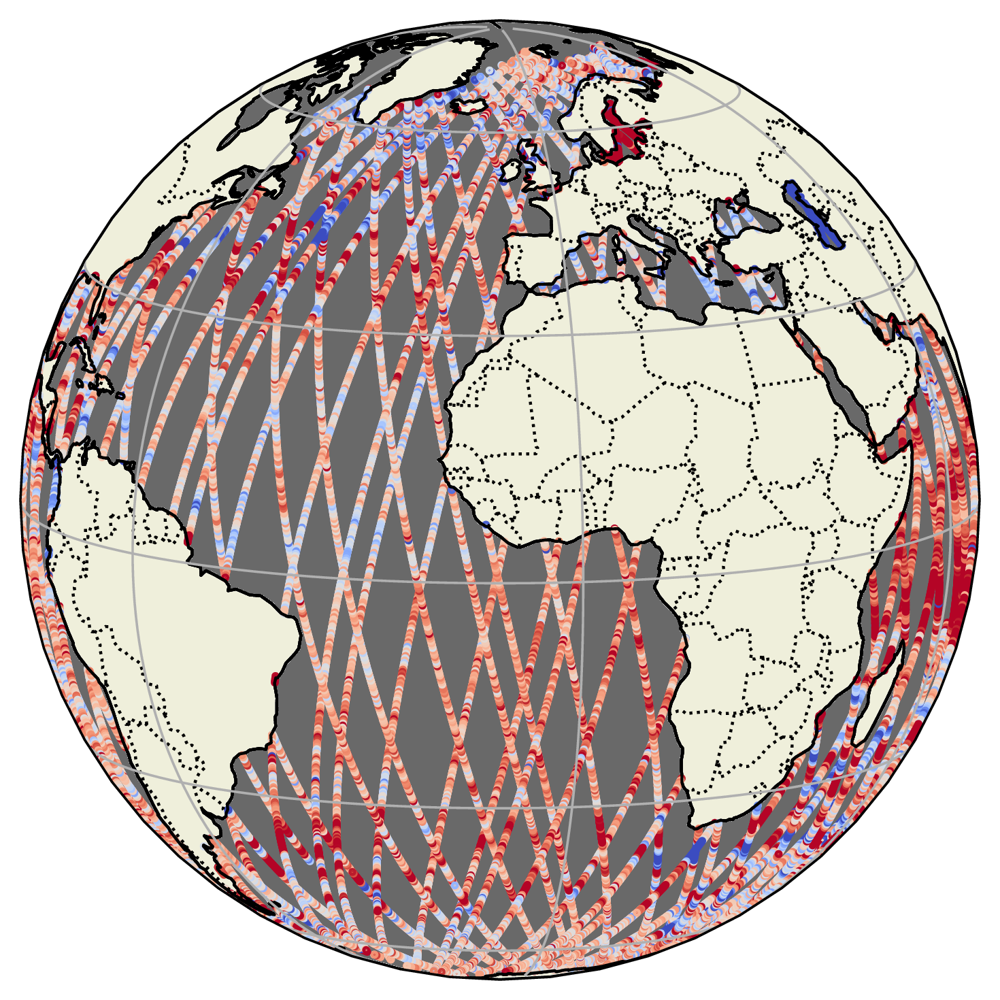
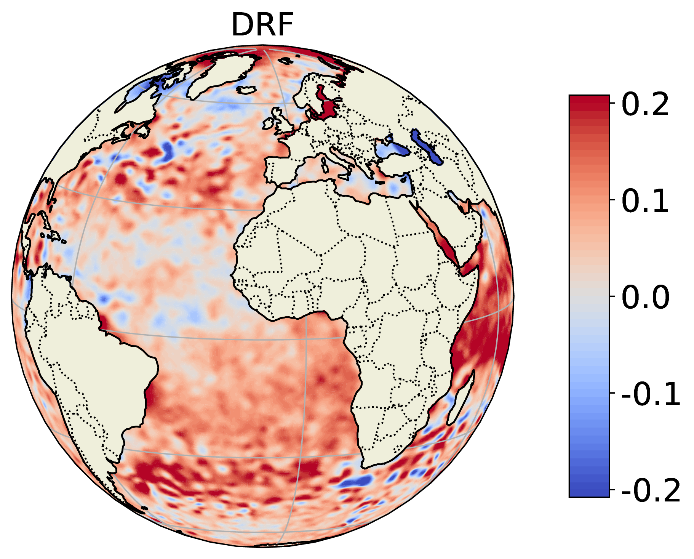
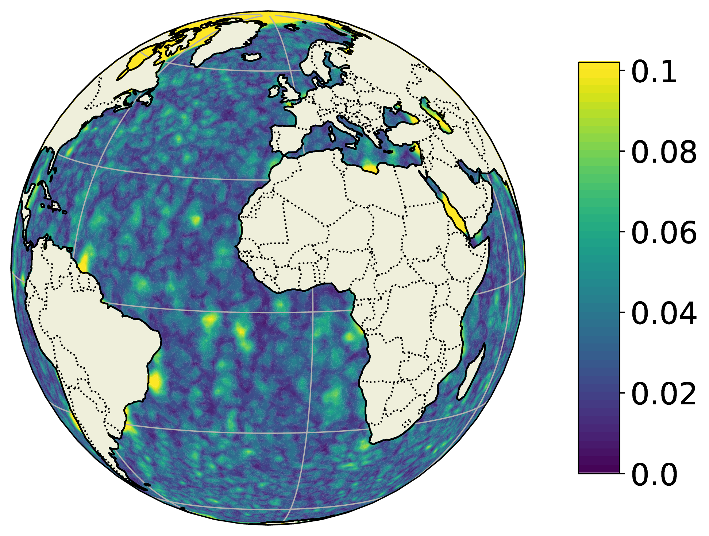

# Deep Random Features

### Repository containing the official PyTorch implementation of the Deep Random Features for Scalable Interpolation of Spatiotemporal Data.

---

## Overview
This repository provides the official PyTorch implementation of the Deep Random Features (DRF) model as introduced in [insert link to the paper here].

**Deep Random Features (DRF)** is a Bayesian deep learning framework designed for scalable interpolation of spatiotemporal data. By leveraging random feature expansions, DRF layers incorporate the inductive bias of stationary Gaussian Processes (GPs), supporting applications both on the **plane** and on the **sphere**. 

DRF is especially well-suited for interpolating diverse types of spatiotemporal data, such as **local** and **global satellite readings**, and offers a flexible approach for modeling complex data patterns. The primary aim of this repository is to:
- Ensure **reproducibility** of the experiments presented in the paper.
- Provide an **easy-to-use implementation** of DRF, making it accessible to researchers as a specialised deep neural network.

<table>
  <tr>
    <td rowspan="2" style="vertical-align: top;">
      
    </td>
    <td style="padding-left: 10px;">
      
    </td>
  </tr>
  <tr>
    <td style="padding-left: 10px;">
      
    </td>
  </tr>
</table>

*Figure 1: Satellite Measurements alongside DRF Predictions and Uncertainties.*

## Installation and Usage
The implementation is purely in Python, and this repository includes example scripts and configuration files to help you get started with DRF.

1. **Clone the Repository**

   ```bash
   git clone https://github.com/totony4real/DeepRandomFeatures.git
   cd DeepRandomFeatures

2. **Create a Virtual Environment**

    You can use conda commands or

    ```bash
    python3 -m venv venv
    source venv/bin/activate

3. Install Required Packages
    ```bash
    pip install -r requirements.txt    

### Example Script
The main example script for **Experiment 1** (local interpolation of synthetic mean sea surface data) is available in:
- [src/DRF/experiment_1.py](src/DRF/main.py)

### Configuration File
To run the example script, you can use the sample configuration file provided here:
- [configs/example_config_exp1.yaml](/home/wch/DeepRandomFeatures/configs/example_config_exp1.yaml)

Ensure that the configuration file paths align with your environment before running the script.

---

## Experiments

### Experiment 1: Synthetic MSS Data
This experiment focuses on interpolating synthetic **Mean Sea Surface (MSS)** data using DRF. The synthetic data is used to evaluate DRF's performance in capturing underlying spatial patterns on a local scale, offering a controlled environment to test its interpolation accuracy.

**To run Experiment 1:**
```bash
python example/experiment_1.py --config configs/example_config/example_config_exp1.yaml
```

### Experiment 2: ABC Freeboard Data
In this experiment, we use **ABC Freeboard data** to test DRF's ability to interpolate satellite-derived freeboard measurements. This data helps evaluate DRF's effectiveness in real-life scenarios where the data is noisy.

**To run Experiment 2:**
```bash
python example/experiment_2.py --config configs/example_config/example_config_exp2.yaml
```

### Experiment 3: SLA Data
This experiment applies DRF to **Sea Level Anomaly (SLA)** data, assessing its capability to generalise and interpolate satellite measurements over the globe. The SLA data provides a global scale challenge for DRF, testing both its spatial and temporal predictive power in a more data-intensive setting.

**To run Experiment 3:**
```bash
python example/experiment_3.py --config configs/example_config/example_config_exp3.yaml
```
---

## Citation
If you use this repository for your research, please cite our paper:
